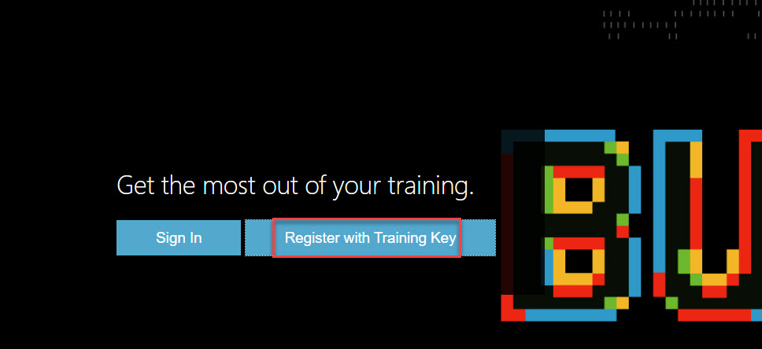
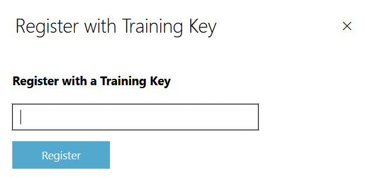
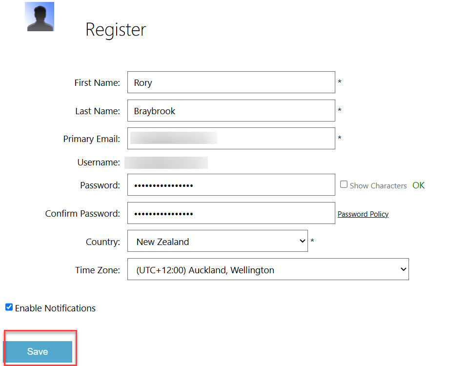
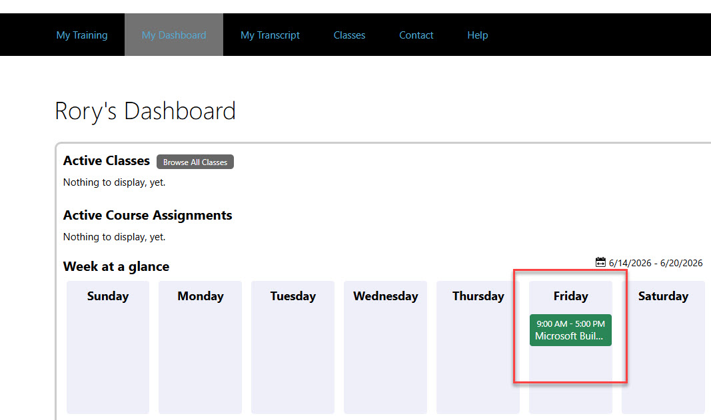
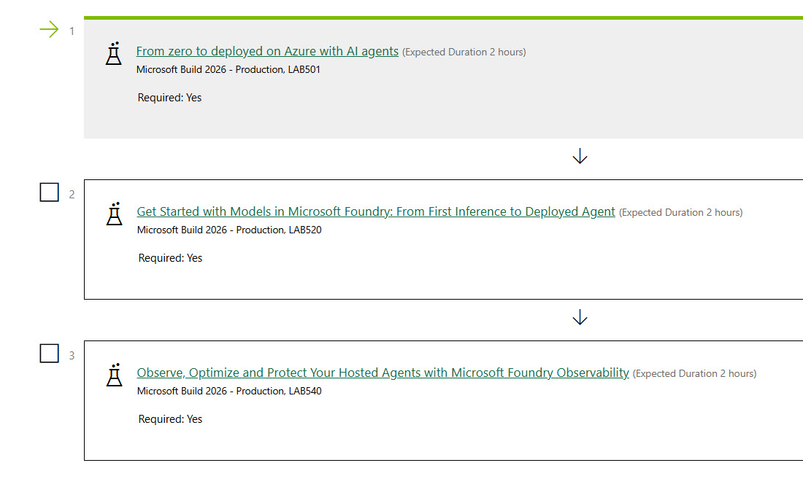
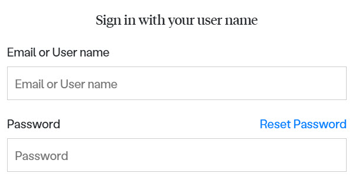

# Welcome to Microsoft Build 2026 //localhost

## Schedule

| Time | Activity | Notes |
| -------- | :------: | -------: |
| 09 00 am | Keynote ||
| 09 30 am | Breakout 1 |
| 10 15 am | Coffee break |
| 10 30 am | Lab 1 |
| 12 00 pm | Lunch |
| 12 30 pm | Breakout 2 |
| 01 15 pm | Lab 2 |
| 02 30 pm | Wrap up |

Breakout 1 is:

Breakout 2 is:

**BRK203**: From CLI to PR: Automating the path to merged code 

and

**BRK206**: Your agent, anywhere: MultiClient, MultiDevice with GitHub Copilot SDK

You can pick any two labs from:

**LAB501**: From zero to deployed on Azure with AI agents

**LAB520**: Get Started with Models in Microsoft Foundry to Build AI Apps

**LAB540**: Observe, optimize and protect your hosted agents in Microsoft Foundry

## Useful links

[Microsoft Build localhost content](https://github.com/microsoft/community-content/wiki/Microsoft-Build---localhost-content)

[Microsoft Build 2026 in two minutes](https://www.youtube.com/watch?v=ZhZqeo7SD0Y)

## How to run the labs

In your browser, navigate to:

https://buildlocalhost.learnondemand.net

Click "Register with Training Key".

The key is:

TBA

Enter your details.

Remember your email and password!

You will see your dashboard.

Click on the lab under "Friday".

You will see all the labs.

Launch the lab.

It will take a few minutes to provision.

Have fun!!!!

If your session times out, go back to the link and click "Sign In".

Then enter your email and password from your registration details.

**Important**

You will have access to the labs until 5 pm today.

## Skillable portal

To see the Skillable portal instruction, go here:

[Portal](Skillable.md)

