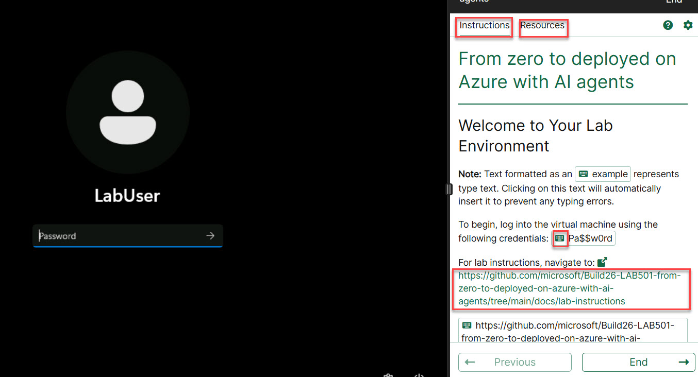
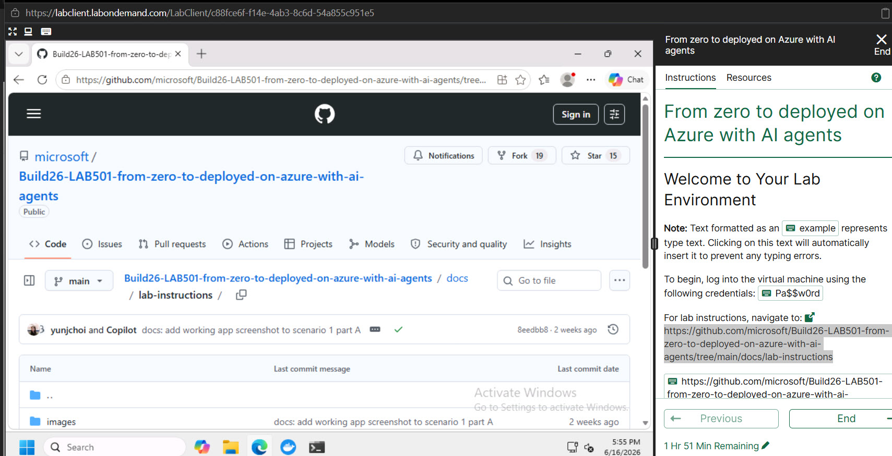
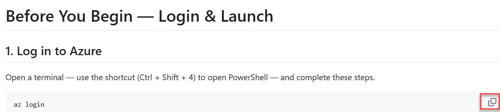
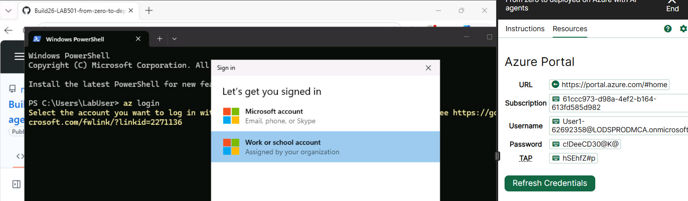
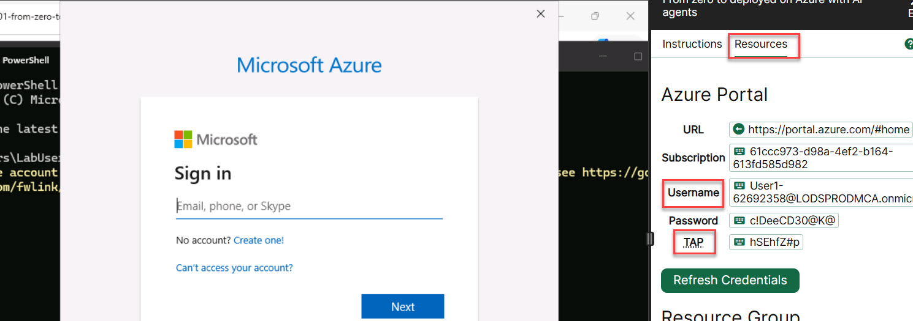
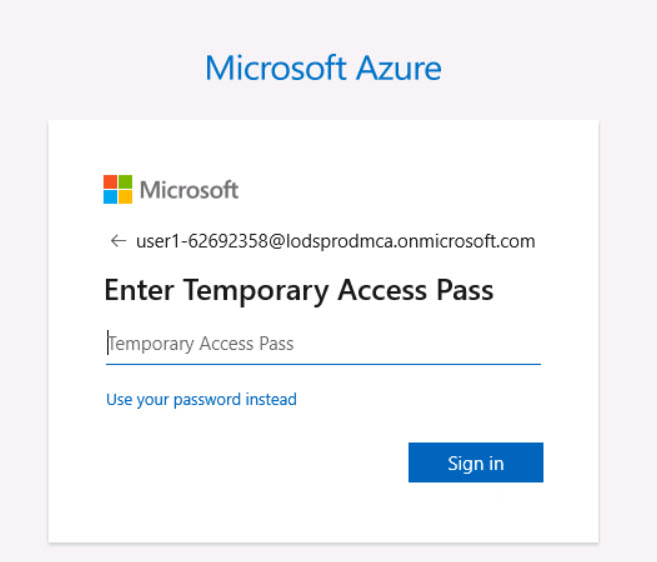
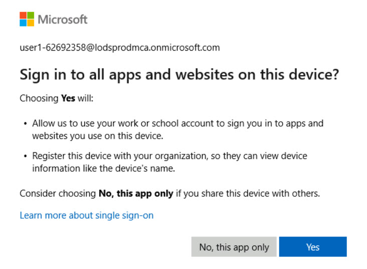
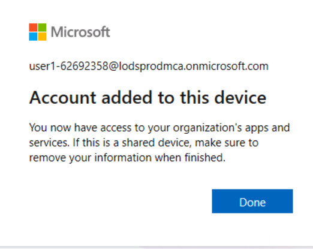
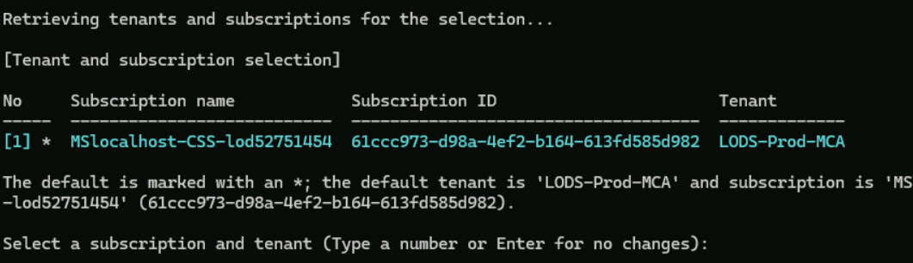

## Skillable portal

Once you launch the lab, you will see the Skillable portal:

On the RHS, you see two tabs:

* Instructions
* Resources

There is also a link to the GutHub repo. that contains the instructions for this lab. that you need to follow.

The keyboard symbol fills in the textbox automatically.

Click the keyboard symbol next to the password and hit "Enter".

Docker will spin up. You don't need to do anything with it.

You will see the portal:

At the bottom, you have the icons for:

Copilot, Explorer, Browser, Docker and Terminal.

Open the broswer and navigate to the Github repo. (link on RHS).

Section 02-login-and-launch shows you need to run:

"az login"

You can use the copy symbol on the right.

Open a terminal session and type this.

Pick "Work or school account" and "Continue".

In the "Resources" tab on the RHS, click the keyboard symbol next to "Username" and "Next".

Then click the keyboard symbol next to TAP and click "Sign In".

Click "Yes".

Click "Done"

Hit "Enter"

To see the full terminal screen, move the window on the RHS to the right.

Then work through the rest of the lab as per the repo.

Good luck and have fun!!!!

